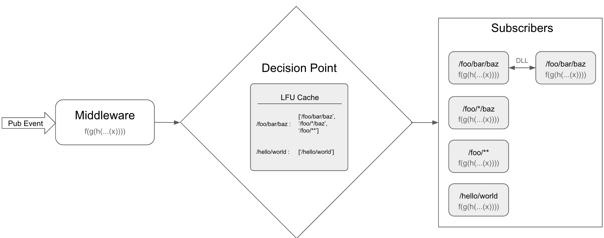

# Architecture

* Every event at first has to go through the registered middlewares pipeline. This gives the user a control on what events are currently flowing in the system and also a way to replicate an issue/bug. This also enables users to create plugins for handling requests, state management, adding timestamps to requests, reporting errors to Sentry etc.
* Post middleware pipeline, Supervised-Emitter will have figure out all the matching subscribers. A naive approach for this is to go through all the subEvents and check if it matches the pubEvent. But repeating this process on each publish cycle might slow down during higher event traffic, hence we decided to use [LFU cache](https://www.npmjs.com/package/node-lfu-cache) for the purpose of storing the matching subEvents against pubEvent. Which is why we recommend not to send data in the event like =&gt; `foo/bar/data123` and instead send it as a part of the data param, if not then the number of events in the system would be very high and would make to whole point of using LFU cache useless.
* The output of the middleware pipeline is then fed to every matching subEvent's associated pipeline parallelly \(in async manner\). This enables us to add custom properties to context in the middleware, so that the same can be used in subscription pipelines. Please ensure that the reserved properties are not overridden on the context. Refer to this [doc](apidocs/interfaces/icontext.md) for reserved properties.
* Any modifications to data in the middleware will be passed to all the subscribers, but any modifications thereafter either to data or the context will be reflected only in the same pipeline. Read more about subscription pipelines [here](terminology.md#subscription-pipeline).

