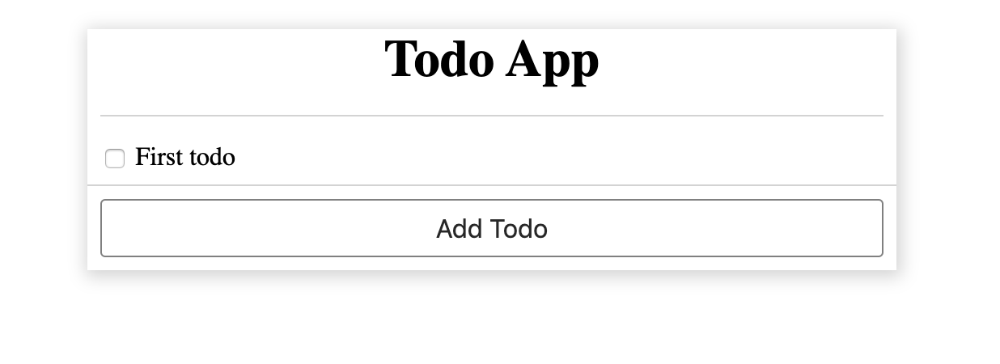

# Step by step tutorial

## Create a simple todo app
We're going to be building a simple todo-app in this step-by-step tutorial.


### Pre-requisites:

Hope you have a basic knowledge of the following technologies:
- Javascript
- React
- HTML
- CSS

If you're good with the above pre-requisites, then let's start the show...

First of all clone this repo:
> git clone https://github.com/AkashBabu/supervised-emitter.git

Then let's scaffold a basic folder structure for a simple web-app; todo that please point your current-working directory to `example/simple-todo-app-tutorial` within this project. This sample scaffolded structure includes a basic setup with [parcel-bundler][1] for building and serving your page (along with HMR).

Now install all the dependencies by running:
> npm install

Then start the UI server:
> npm start

Open `http://localhost:1234` in your browser and you should see  


**Disclaimer** : The intention of this tutorial is NOT to teach [ReactJS][2], instead it's about inducting `Supervised-Emitter` only! Hence the boilerplate would include a completely functional code. Your job would be to modify the code and adapt `Supervised-Emitter` in the project and know how easy it becomes thereafter.

This is how the components in this project are connected:
```
  App
    + Todo
      - TodoItem
      - NewTodo
      + TodoAdd
        - Button
```
As you might have noticed, folder structure is not as a typical [ReactJS][2] project, this is intentional to illustrate the nesting of components.


Enough of talking, let's get our hands dirty with `Supervised-Emitter`

So let's go and install `Supervised-Emitter`:
> npm i supervised-emitter -S

Then create a new file `src/supervisedEmitter.js`:
```JS
import SupervisedEmitter from 'supervised-emitter';

const SE = new SupervisedEmitter();

export default SE;
```
This file would create an instance and we can use the same throughout our application for communicating between components, state-management etc...


Let's create our first event publisher in `src/Todo/TodoItem.jsx`:
Add SE to your imports:
```JS
import SE from '../supervisedEmitter'
```
and then create a function `handleChange`:
```JS
function handleChange() {
  SE.publish('input/text/todo/item/change', todo)
}
```

Then change the `onChange` handler to `handleChange`:
```JS
<input type="checkbox" name="todo_checkbox" checked={todo.completed} onChange={handleChange} id={itemId} />
```


Now your `TodoItem.jsx` should look like this
```JSX
import React from 'react'
import SE from '../supervisedEmitter'

export default function TodoItem({todo, onChange}) {
  let style = {}

  if(todo.completed) {
    style = {
      color: 'grey',
      fontStyle: 'italic',
      textDecoration: 'line-through'
    }
  }

  function handleChange() {
    SE.publish('input/text/todo/item/change', todo)
  }
  
  const itemId = `todoitem_${todo.id}`

  return (
    <div style={{padding: '0.5em', borderBottom: '1px solid lightgrey'}}>
      <label htmlFor={itemId}>
        <input type="checkbox" name="todo_checkbox" checked={todo.completed} onChange={handleChange} id={itemId} />
        &nbsp;
        <span style={style}>{todo.data}</span>
      </label>
    </div>
  )
}
```
What the above code essentially means is that, I don't care if anybody is listening to my changes or not, but I'm simplying gonna be yelling about it.

It's pity that nobody is listening to our `TodoItem`, so let's create our first listener at `Todo.jsx`

Add SE to your imports:
```JS
import SE from '../supervisedEmitter';
```


1) Now let's look at our first problem:  
**If there is more than one level of nesting, then `handlers` needed by grand-child components must be passed to child components as well**  
I kind of agree to this

[1]: https://parceljs.org/
[2]: https://reactjs.org/